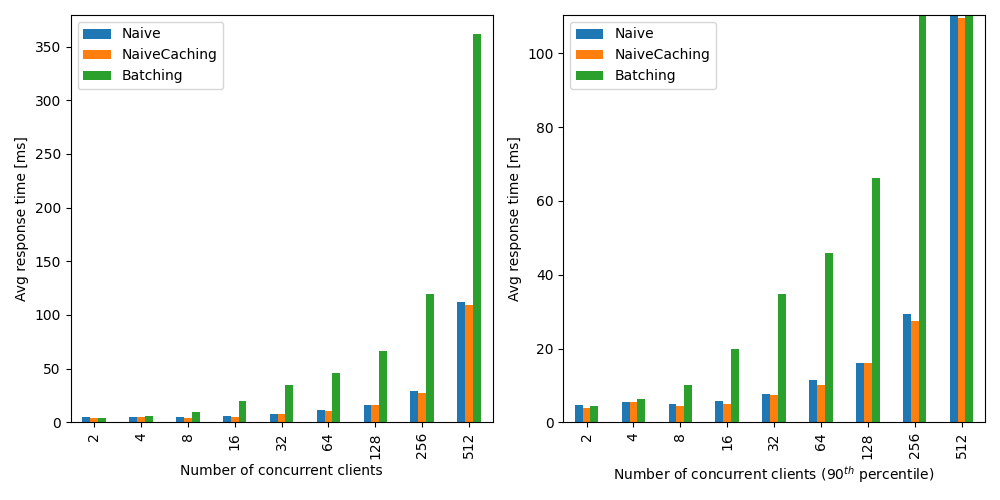
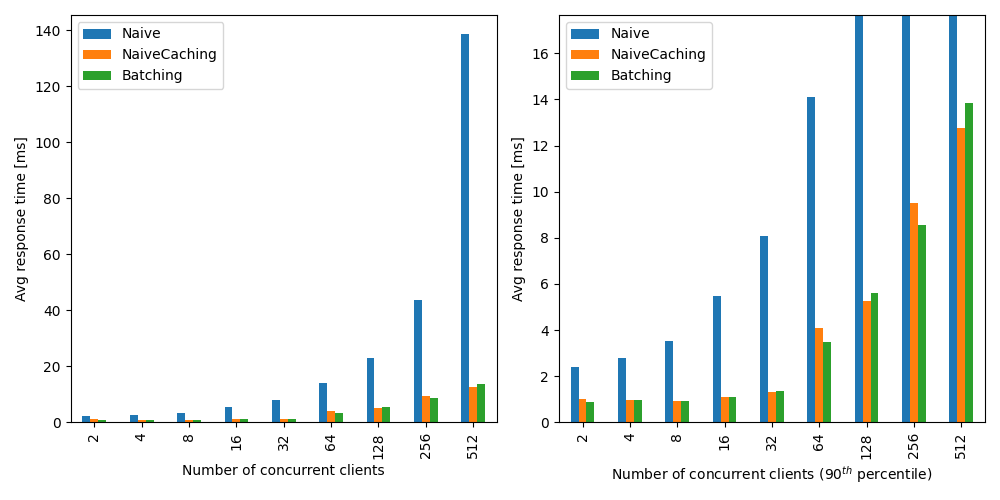
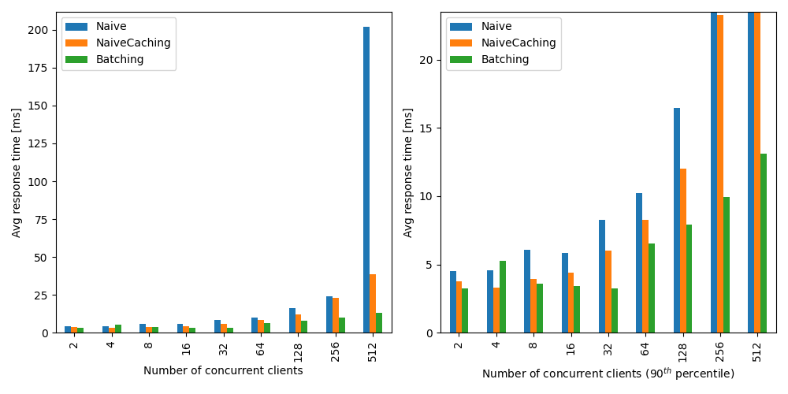
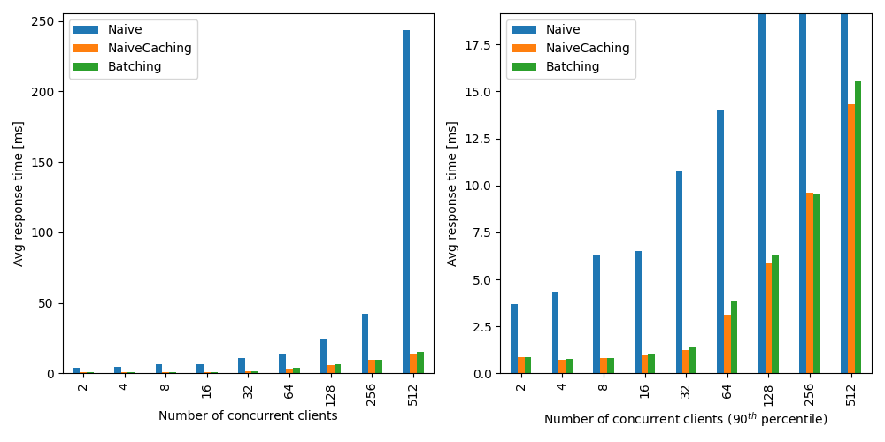
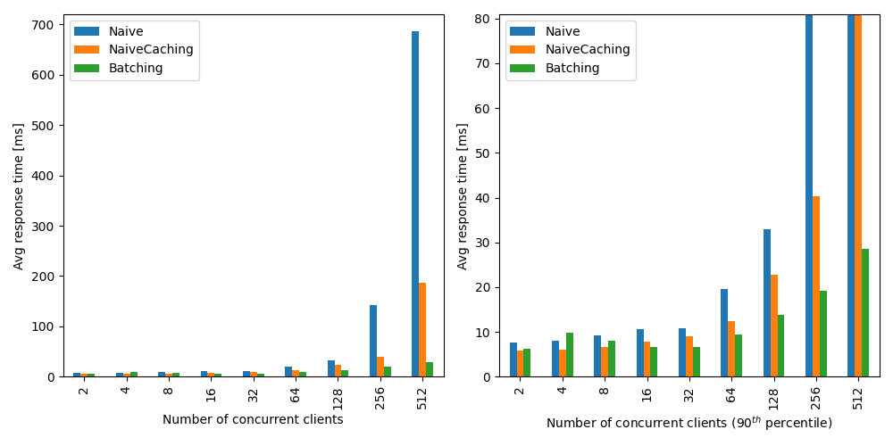
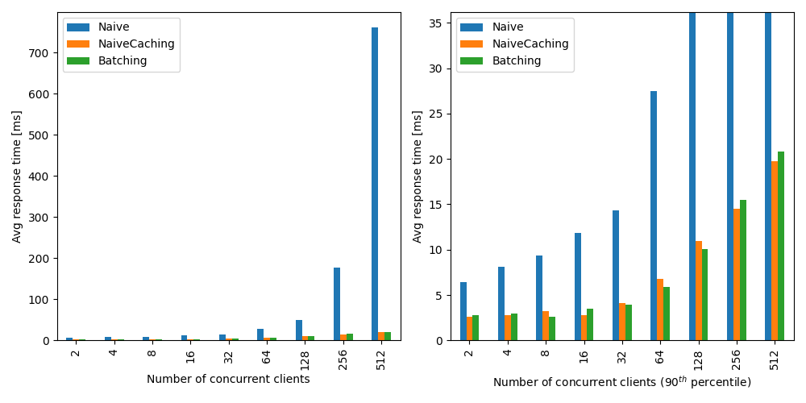
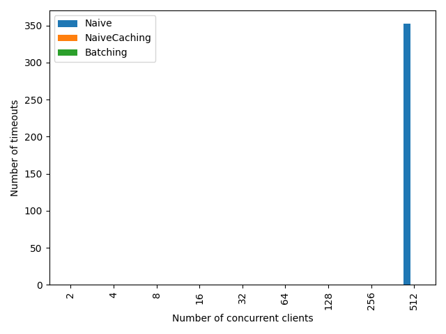
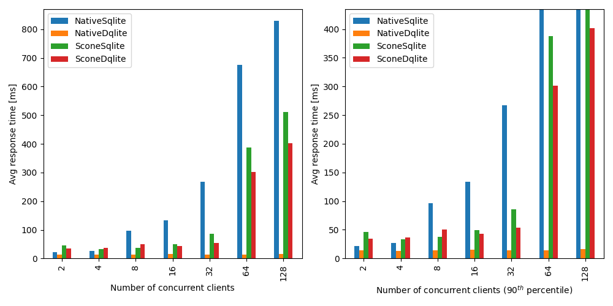
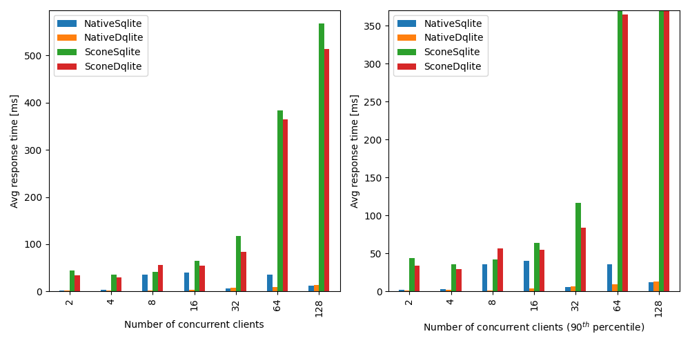

# lld leasing

## Build

```bash
% Build dqlite server image
docker build -f docker/native-dqlite.Dockerfile -t pixix4/native-dqlite:latest .
docker build -f docker/scone-dqlite.Dockerfile -t pixix4/scone-dqlite:latest .

% Build leasing server image
docker build -f docker/server-scone-dqlite.Dockerfile -t pixix4/server-scone-dqlite:latest .

% Setup scone
./create_image.sh
```

## Run

```bash
source myenv

% Start server
docker-compose -f docker-compose-scone-dqlite.yml up

% Start client
cargo run --release -p lld-client -- 1
```

If their is a attestation failure message like following you need to update the `DQLITE_MRENCLAVE` (or `SERVER_DQLITE_MRENCLAVE`) variable within `create_image.sh` and rerun the script.
```
[SCONE|FATAL] src/process/init.c:476:__scone_prepare_secure_config(): Could not initialize enclave state: Attestation failed
  Caused by: CAS sent an attestation/configuration error: SCONE quote verification failed
  Caused by: Failed to verify SCONE remote attestation report
  Caused by: The program enclave is not trustworthy
```

Currently the server cannot start, cause the dqlite c_client halts the execution due to a failed initialization.

```
lld-server-dqlite_1  | clients: 3
lld-server-dqlite_1  | Connecting to socket "172.20.0.11:24000" 0x10012d62a0
lld-server-dqlite_1  | c_client - ip: 172.20.0.11
lld-server-dqlite_1  | Connected to socket "172.20.0.11:24000": 0
lld-server-dqlite_1  | Init client "172.20.0.11:24000"
lld-server-dqlite_1  | Init client "172.20.0.11:24000" finished: 0
lld-server-dqlite_1  | Handshake to client "172.20.0.11:24000"
lld-server-dqlite_1  | Handshake to client "172.20.0.11:24000" finished 0
lld-server-dqlite_1  | Connecting to socket "172.20.0.11:25000" 0x10012d62e0
lld-server-dqlite_1  | Connected to socket "172.20.0.11:25000": 0
lld-server-dqlite_1  | Init client "172.20.0.11:25000"
lld-server-dqlite_1  | Init client "172.20.0.11:25000" finished: 0
lld-server-dqlite_1  | Handshake to client "172.20.0.11:25000"
lld-server-dqlite_1  | Handshake to client "172.20.0.11:25000" finished 0
lld-server-dqlite_1  | Connecting to socket "172.20.0.11:26000" 0x10012d6380
lld-server-dqlite_1  | Connected to socket "172.20.0.11:26000": 0
lld-server-dqlite_1  | Init client "172.20.0.11:26000"
lld-server-dqlite_1  | Init client "172.20.0.11:26000" finished: 0
lld-server-dqlite_1  | Handshake to client "172.20.0.11:26000"
lld-server-dqlite_1  | Handshake to client "172.20.0.11:26000" finished 0
lld-server-dqlite_1  | Adding server "172.20.0.11:25000" 0x10012d62e0
lld-server-dqlite_1  | Error:: No error information
lld-server-dqlite_1  | Added server "172.20.0.11:25000": -1
lld-server-dqlite_1  | Adding server "172.20.0.11:26000" 0x10012d6380
lld-dqlite_1         | [SCONE|WARN] src/syscall/syscall.c:31:__scone_ni_syscall(): system call: io_setup, number 206 is not supported
```

Alternativly their is  a working version that uses dqlite without scone:

```bash
docker-compose -f docker-compose-scone-dqlite2.yml up

% Start client
cargo run --release -p lld-client -- 1
% Or manuelly request a lease
curl -k -X POST -H "Content-Type: application/json" -d '{"application_id": "1", "instance_id": "1", "duration": 5000}' https://localhost:3030/request
```

In this setup dqlite seems to have problems too. The lld-server only can connect to the first server and when executing a command with `dqlite -s 172.20.0.11:24000,172.20.0.11:25000,172.20.0.11:26000 leasings` the following log output is continously created within the dqlite container:

```
Listen callback triggered
[DEBUG] Using TCP
[DEBUG] Reading received protocol
[DEBUG] Transport read callback
[DEBUG] Transport read callback - nread > 0 - successful
[DEBUG] protocol callback
[DEBUG] before decoding
[DEBUG] after decoding
[DEBUG] protocol is ok
[DEBUG] Reading received message
[DEBUG] Transport read callback
[DEBUG] Transport read callback - nread > 0 - successful
[DEBUG] Reading received request
[DEBUG] Transport read callback
[DEBUG] Transport read callback - nread > 0 - successful
Request being handled by the gateway
[DEBUG] Reading received message
[DEBUG] Transport read callback
[DEBUG] Transport read callback - nread < 0 - something wrong with the buffer?
```

## Benchmark

```bash
cargo run --release -p lld-benchmark | tee benchmark.csv
python3 benchmark.py logs/benchmark.csv
```

Usage of `lld-benchmark`:

```
USAGE:
    lld-benchmark [OPTIONS] [SUBCOMMAND]

FLAGS:
    -h, --help       Prints help information
    -V, --version    Prints version information

OPTIONS:
    -c, --container <container>     [env: LLD_CONTAINER=]  [possible values: NativeSqlite, NativeDqlite, SconeSqlite,
                                   SconeDqlite]
    -d, --duration <duration>       [env: LLD_DURATION=]
        --build <force_build>       [env: LLD_FORCE_BUILD=]
        --http_uri <http_uri>       [env: LLD_HTTP_URI=]
    -m, --max <max>                 [env: LLD_MAX=]
    -r, --repeat <repeat>           [env: LLD_REPEAT=]
        --tcp_uri <tcp_uri>         [env: LLD_TCP_URI=]

SUBCOMMANDS:
    help     Prints this message or the help of the given subcommand(s)
```

A benchmark round creates `N` clients that continuously send leasing requests for 3 seconds. 2 clients each use the same `application id` with different `instance id`s. Thus there are `N/2` clients with granted leases and `N/2` clients with rejected leases. Leasings requests timeout after 1 second.

- AMD EPYC (with IBPB) (4) @ 2.495GHz with 8 GiB memory

### Use sqlite file as database

Average response time of granted leases relative to the number of concurrent clients:



Average response time of rejected leases relative to the number of concurrent clients:



Number of timeouts relative to the number of concurrent clients:

- No timeouts

### Use local dqlite cluster with 3 servers as database

Average response time of granted leases relative to the number of concurrent clients:



Average response time of rejected leases relative to the number of concurrent clients:



Number of timeouts relative to the number of concurrent clients:

- No timeouts

### Use local dqlite cluster with 3 servers as database and scone build (simulation mode)

Average response time of granted leases relative to the number of concurrent clients:



Average response time of rejected leases relative to the number of concurrent clients:



Number of timeouts relative to the number of concurrent clients:



### Use scone attestation for server

Average response time of granted leases relative to the number of concurrent clients:



Average response time of rejected leases relative to the number of concurrent clients:


