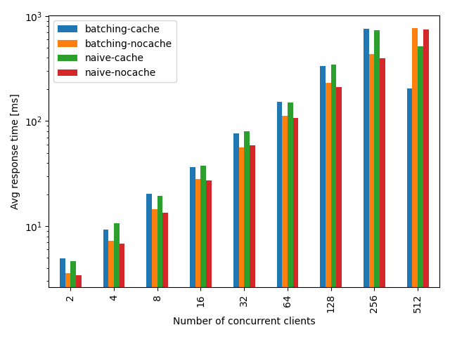
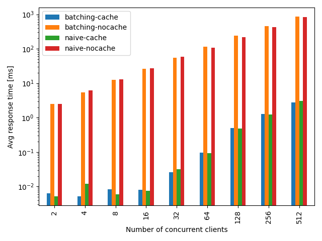
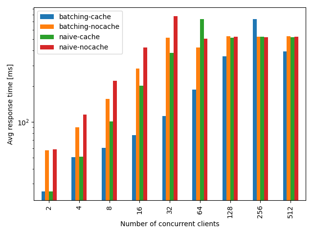
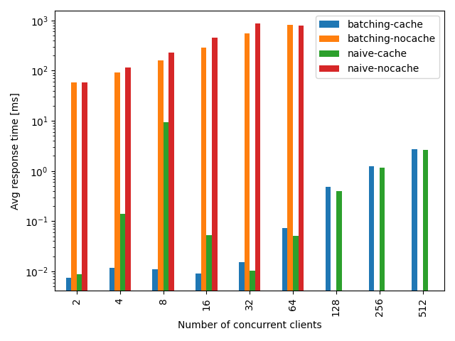
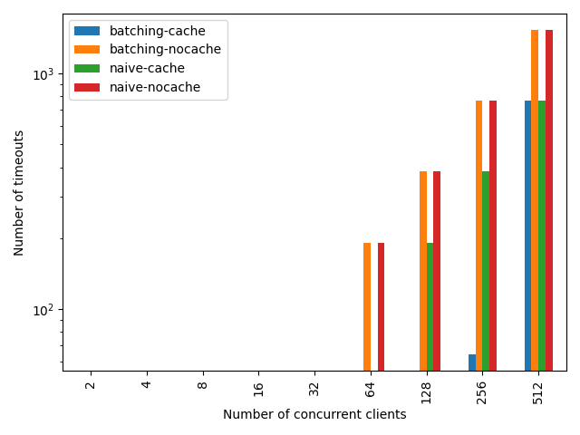
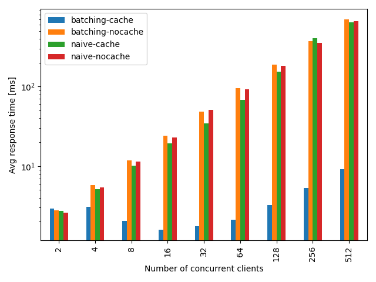
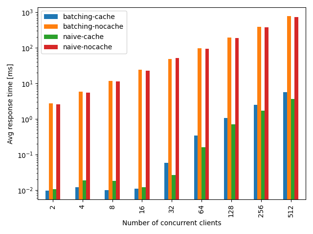
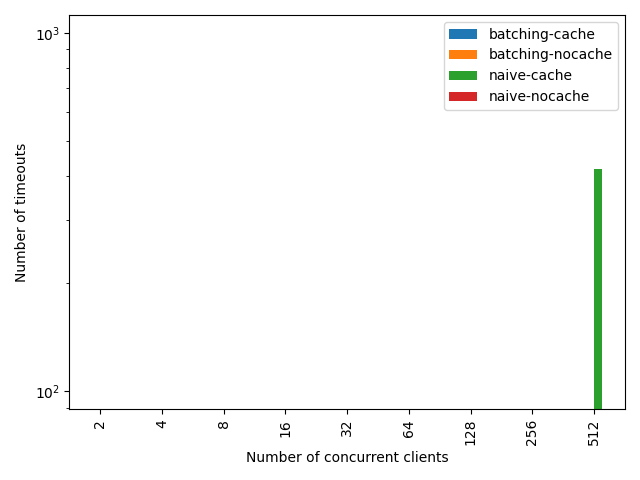

# lld leasing

## Build

```bash
docker build -t pixix4/lld:latest -f docker/server-sqlite.Dockerfile .
```

## Run

```bash
docker run --rm -it -p 3030:3030 -p 3040:3040 pixix4/lld:latest

docker run --rm -it -p 24000:24000 -p 25000:25000 -p 26000:26000 pixix4/dqlite:latest
```

## Benchmark

```bash
docker run --rm pixix4/lld:latest benchmark --repeat=4 --max=10 > ./logs/benchmark.csv
python3 benchmark.py
```

A benchmark round creates `N` clients that continuously send leasing requests for 3 seconds. 2 clients each use the same `application id` with different `instance id`s. Thus there are `N/2` clients with granted leases and `N/2` clients with rejected leases. Leasings requests timeout after 1 second.

### Use sqlite file as database

Average response time of granted leases relative to the number of concurrent clients:



Average response time of rejected leases relative to the number of concurrent clients:



Number of timeouts relative to the number of concurrent clients:


### Simulate dqlite network delay with a 10ms sleep before each sqlite request

Average response time of granted leases relative to the number of concurrent clients:



Average response time of rejected leases relative to the number of concurrent clients:



Number of timeouts relative to the number of concurrent clients:



### Use local dqlite cluster with 3 servers as database

Average response time of granted leases relative to the number of concurrent clients:



Average response time of rejected leases relative to the number of concurrent clients:



Number of timeouts relative to the number of concurrent clients:


